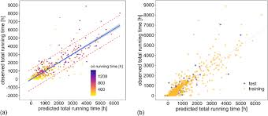

# AI-Enabled Data Integrity Assistant  
© 2025 Kent Joshi. All rights reserved.

Hi, welcome to my AOS C204 final project!

## My Project
I applied machine learning techniques to build an AI-enabled assistant that flags suspicious quality-control (QC) records in a synthetic LIMS dataset. Below is my report.

## Introduction
Ensuring data integrity in regulated QC laboratories is critical because assay results and associated metadata directly support product quality and release decisions. In practice, QC records may contain out-of-range measurements, abnormal run conditions, or missing and inconsistent metadata, all of which increase review burden and data-integrity risk.

A synthetic LIMS-like dataset containing numeric assay/process features and categorical metadata enables a supervised machine learning approach. Using this dataset, I framed the problem as a binary classification task: predicting whether a QC record should be flagged as suspicious. I addressed this problem using a supervised learning model to prioritize human review while supporting ALCOA+ expectations in regulated environments.

## Data
The dataset consists of approximately 2,000 synthetic QC records designed to resemble real LIMS data. Each record includes numeric assay results and process-related variables, categorical metadata such as assay type, instrument, and operator, and a binary label (`is_suspicious`) indicating whether the record should be flagged for review.

Prior to modelling, missing numeric values were imputed, categorical values were completed using the most frequent category, numeric features were scaled, and categorical features were one-hot encoded. The dataset was then split into training and test sets.

*Figure 1: Expected versus observed assay results for synthetic LIMS quality-control (QC) records. Records flagged as `is_suspicious` appear as outliers and clustered deviations from the expected–observed relationship.*

## Modelling
Because the dataset includes labeled examples, a supervised classification approach was appropriate. I selected a RandomForest classifier due to its ability to model nonlinear relationships, handle mixed feature types, and provide interpretable feature-importance measures.

The modelling pipeline consisted of preprocessing steps followed by RandomForest training and evaluation. Model performance was assessed using standard classification metrics, and feature importance was examined to understand which variables most influenced suspicious classifications.

## Results
The trained model successfully separated suspicious from non-suspicious records on held-out test data. Performance was evaluated using precision, recall, confusion matrices, and ROC-AUC to quantify the tradeoff between identifying true issues and minimizing false positives.

Feature-importance analysis indicated that differences between expected and observed assay results, along with selected process and metadata variables, were key drivers of model predictions.

## Discussion
The results demonstrate that a supervised machine learning model can learn meaningful patterns in LIMS-style QC data and generate useful “flag for review” signals. Such an approach can help focus human review effort on the highest-risk records while maintaining transparency through interpretable features.

A limitation of this study is the use of a synthetic, rule-derived dataset. In real-world applications, model training and validation would require historically adjudicated QC records, along with formal governance, validation, and monitoring to meet regulatory expectations.

## Conclusion
This project shows that an AI-enabled data integrity assistant can support QC data review by prioritizing suspicious records rather than replacing human judgment. The approach aligns with ALCOA+ principles by improving consistency and traceability in review workflows.

Future work could extend this project by increasing dataset realism, incorporating drift and bias, and integrating a human-in-the-loop feedback mechanism within a regulated LIMS environment.

## References
[1] Synthetic LIMS dataset and figures generated for this project (Kent Joshi, 2025).
